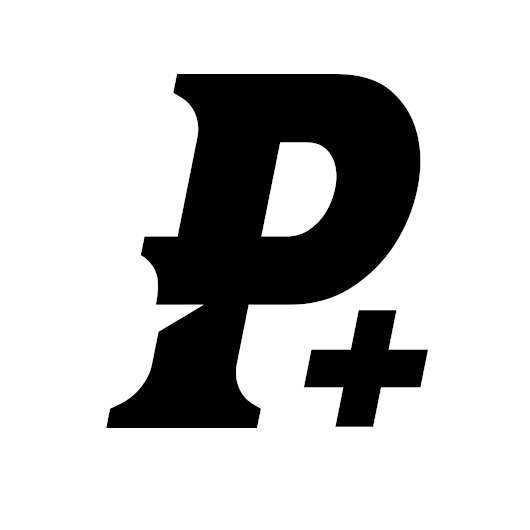
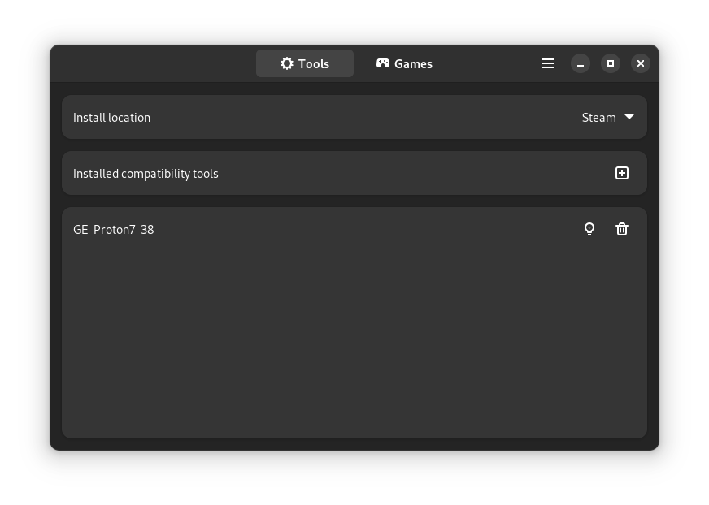

<h1 align="center">ProtonPlus (WIP)</h1>

<p align="center">
    
    <a href="https://github.com/Vysp3r/ProtonPlus/releases/latest">
      
    </a>
    <a>
      
    </a>
    <a href="https://t.me/ProtonPlusOfficial">
      
    </a>
</p>

<p align="center">
    <i>Join the telegram! — Don't forget to star the repo if you are enjoying the project!</i>
</p>

- - - -

ProtonPlus is a simple Proton version manager that make it easy to install and manage Proton versions. It works with Steam, Lutris, Heroic Games Launcher and Bottles. It was made in Vala with GTK4 and Libadwaita using GNOME Builder. <b>This project is still in its early phase, so please keep that in mind before using it.</b>

If you have any questions about ProtonPlus or want to share information with us, please go to one of the following places:



- [Github Discussions](https://github.com/Vysp3r/ProtonPlus/discussions)
- [Telegram Server](https://t.me/ProtonPlusOfficial)

*Before you file an [issue](https://github.com/Vysp3r/ProtonPlus/issues/new/choose), make sure you have read the [known issues](#-known-issues) section.*

**For more information, [read the documentation!](https://github.com/Vysp3r/ProtonPlus/wiki)**

- - - -

## ✨ Features
- Install and manage Proton versions for Steam, Lutris, Bottles and Heroic Games Launcher
- And much more...

- - - -

## 👀 Preview


- - - -

## 💥 Known Issues

- None

- - - -

## 📝 TODOs

- Add localization
- Comment the code
- Document the project
- Add a game list with additional data like Deck compatibility and Anti-cheat status
- Add the ability to add custom locations
- Add games specific fixes (ex. Star Citizen)
- Add an update notification system

- - - -

## ⁉️ ProtonPlus vs ProtonUp-Qt

|                   | ProtonPlus                                  | ProtonUp-Qt                                      |
| :---------------- | :-----------------------------------------: | :----------------------------------------------: |
| **GUI Toolkit**   | [GTK4](https://gitlab.gnome.org/GNOME/gtk)  | [QT](https://www.qt.io/)                         |
| **Language**      | [Vala](https://gitlab.gnome.org/GNOME/vala) | [Python](https://www.python.org/)                |
| **Based on**      | Nothing                                     | [ProtonUp](https://github.com/AUNaseef/protonup) |
| **Looks best on** | [GNOME](https://gitlab.gnome.org/GNOME)     | [KDE](https://kde.org/)                          |

- - - -

### 🛠️ Building from Source

_Requirements_
- [meson](https://github.com/mesonbuild/meson)
- [gtk4](https://gitlab.gnome.org/GNOME/gtk/)
- [libadwaita-1](https://gitlab.gnome.org/GNOME/libadwaita)
- [json-glib-1.0](https://gitlab.gnome.org/GNOME/json-glib)
- [libsoup-3.0](https://gitlab.gnome.org/GNOME/libsoup)
- [libarchive](https://github.com/libarchive/libarchive)

**Installing**

- Clone the GitHub repo: `git clone https://github.com/Vysp3r/ProtonPlus.git` & `cd ProtonPlus`
- Install all dependencies (I'm using Fedora 36): `sudo dnf install meson gtk4-devel libadwaita-devel json-glib-devel libsoup3-devel libarchive-devel`
- Build the source: `TODO`
- Start the application: `TODO`

- - - -

## 💖 Contributing
**Please read our [Contribution Guidelines](/CONTRIBUTING.md)**

All contributions are highly appreciated.

- - - -

## 📜 License

ProtonPlus is licensed under [GPL 3.0](/LICENSE.md)

```
 Copyright © 2022 Charles "Vysp3r" Malouin
 
 This program is free software: you can redistribute it and/or modify
 it under the terms of the GNU General Public License as published by
 the Free Software Foundation, either version 3 of the License, or
 (at your option) any later version.
 
 This program is distributed in the hope that it will be useful,
 but WITHOUT ANY WARRANTY; without even the implied warranty of
 MERCHANTABILITY or FITNESS FOR A PARTICULAR PURPOSE.  See the
 GNU General Public License for more details.
 
 You should have received a copy of the GNU General Public License
along with this program.  If not, see <http://www.gnu.org/licenses/>.
```

**[⤴️ Back to Top](#ProtonPlus)**
