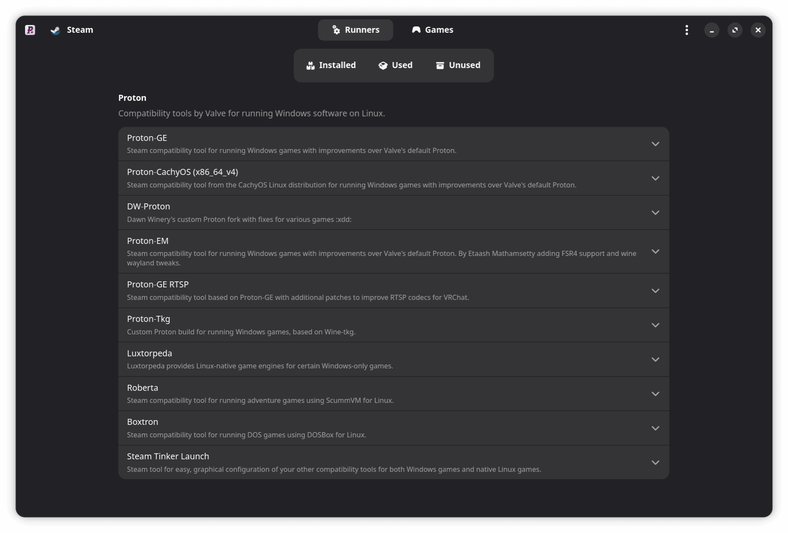
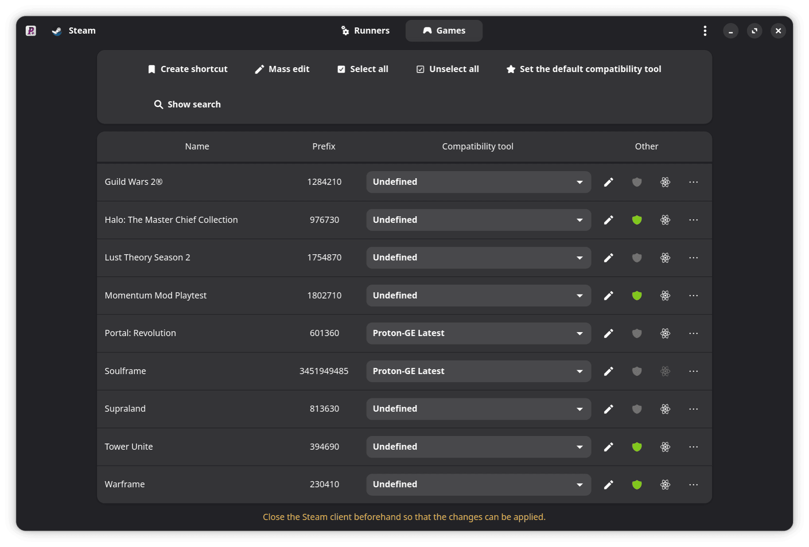
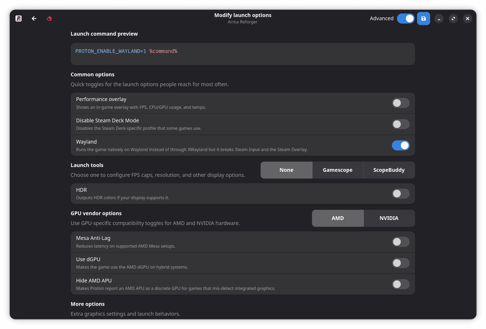
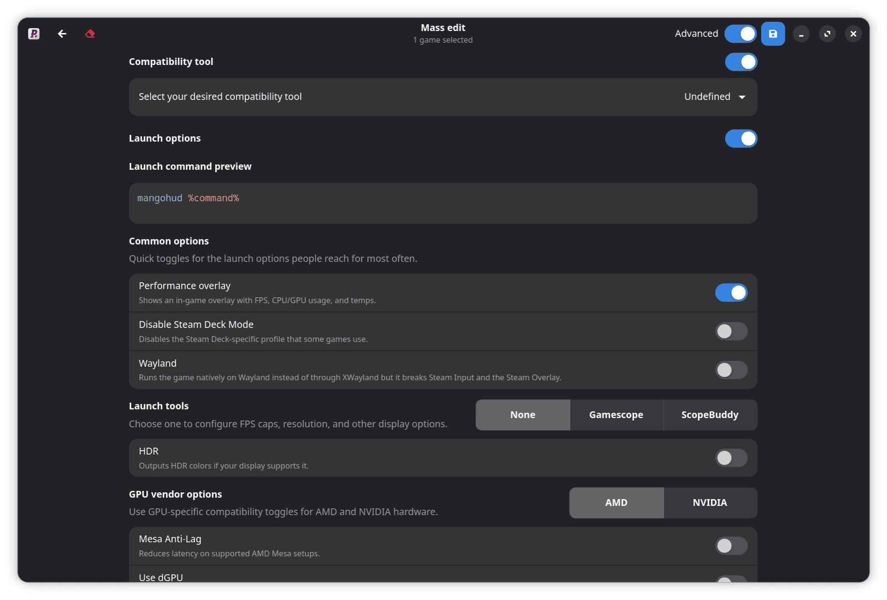

<h1 align="center">
    
    <br><br>
    ProtonPlus
</h1>

<p align="center">
  <strong>A modern compatibility tools manager for Linux</strong>
</p>

<p align="center">
    <a href="https://github.com/Vysp3r/ProtonPlus/stargazers">
      
    </a>
    <a href="https://github.com/Vysp3r/ProtonPlus/releases/latest">
      
    </a>
    <a href="https://klausenbusk.github.io/flathub-stats/#ref=com.vysp3r.ProtonPlus&interval=infinity&downloadType=installs%2Bupdates">
      
    </a>
    <a href="https://github.com/Vysp3r/ProtonPlus/blob/main/LICENSE.md">
      
    </a>
    <a href="https://hosted.weblate.org/engage/protonplus/">
        
    </a>
    <a href="https://protonplus.vysp3r.com/#donate">
      
    </a>
</p>

<p align="center">
    <i>Don't forget to star the repo if you are enjoying the project!</i>
</p>

---

ProtonPlus is a modern compatibility tools manager for Linux. It allows you to easily manage and update various compatibility tools like Proton, Wine, DXVK, and VKD3D across different launchers.

## 📋 Table of Contents

- [✨ Features](#-features)
- [🖼️ Screenshots](#️-screenshots)
- [🎮 Supported Launchers](#-supported-launchers)
- [🛠️ Supported Compatibility Tools](#️-supported-compatibility-tools)
- [📦 Installation Methods](#-installation-methods)
- [🏗️ Building from Source](#️-building-from-source)
- [📖 Wiki](#-wiki)
- [🌐 Translate](#-translate)
- [🙌 Contribute](#-contribute)
- [👥 Contributors](#-contributors)

## ✨ Features

- 🚀 **Multi-Launcher Support**: Manage tools for Steam, Lutris, Heroic, Bottles, and more.
- 🎮 **Steam Integration**: Change compatibility tools and launch options for your Steam games directly.
- 🔄 **Easy Updates**: One-click updates for your installed compatibility tools.
- 💻 **CLI Support**: Manage your tools from the comfort of your terminal.
- 🎨 **Modern UI**: Built with GTK4 and Libadwaita for a consistent GNOME experience.
- 🔍 **Tool Management**: See which tools are currently in use by your games.

## 🖼️ Screenshots

<p align="center">
  
  
  <br>
  
  
</p>

## 🎮 Supported Launchers

- [Steam](https://store.steampowered.com/about/)
- [Lutris](https://lutris.net/)
- [Heroic Games Launcher](https://heroicgameslauncher.com/)
- [Bottles](https://usebottles.com/)
- [WineZGUI](https://github.com/B_S_D/WineZGUI)

*The launcher you wanted is missing? Simply request for it to be added [here](https://github.com/Vysp3r/ProtonPlus/issues/new?template=feature_request.md)!*

## 🛠️ Supported Compatibility Tools

<details open>
<summary><b>Proton & Wrappers</b></summary>

- Steam Tinker Launch
- Proton-GE
- Proton-GE RTSP
- Proton-CachyOS
- DW-Proton
- Proton-EM
- Proton-Tkg
- Luxtorpeda
- Boxtron
- Roberta
</details>

<details>
<summary><b>Wine Builds</b></summary>

- Wine-Vanilla
- Wine-Staging
- Wine-Staging-Tkg
- Wine-Proton
</details>

<details>
<summary><b>Graphics Libraries (DXVK & VKD3D)</b></summary>

- DXVK (doitsujin)
- DXVK (Sarek)
- DXVK Async (Sarek)
- DXVK GPL+Async (Ph42oN)
- VKD3D-Proton
- VKD3D-Lutris
</details>

*The compatibility tool you wanted is missing? Simply request for it to be added [here](https://github.com/Vysp3r/ProtonPlus/issues/new?template=feature_request.md)!*

## 📦️ Installation methods

<a href="https://flathub.org/apps/com.vysp3r.ProtonPlus">
    
</a>

> [!IMPORTANT]
> The main installation method is Flathub.

### Community Packages

| Distribution | Repository | Maintainer |
| --- | --- | --- |
| **Arch Linux** | [AUR](https://aur.archlinux.org/packages/protonplus) | [yochananmarqos](https://github.com/yochananmarqos) |
| **Fedora** | [COPR](https://copr.fedorainfracloud.org/coprs/wehagy/protonplus/) | [wehagy](https://github.com/wehagy) |
| **NixOS** | [nixpkgs](https://mynixos.com/nixpkgs/package/protonplus) | [Seth](https://github.com/seth-foss) |
| **Ubuntu** | [Pacstall](https://pacstall.dev/packages/protonplus) | [Vysp3r](https://github.com/Vysp3r) |
| **openSUSE** | [OBS](https://software.opensuse.org/package/ProtonPlus) | [rrahl0](https://github.com/rrahl0) |
| **Void Linux** | [GitHub](https://github.com/xJayMorex/ProtonPlus-void) | [xJayMorex](https://github.com/xJayMorex) |
| **Gentoo** | [Overlay](https://github.com/amielke/amielke-overlay/tree/master/games-util/ProtonPlus) | [amielke](https://github.com/amielke) |

## 🏗️ Building from source

### Requirements

- `git`
- `ninja`
- `meson >= 1.0.0`
- `vala`
- `gtk4`
- `libadwaita >= 1.6`
- `json-glib`
- `libsoup-3.0`
- `libarchive`
- `desktop-file-utils`
- `libgee`

### Build instructions

<details>
  <summary>Native Build</summary>

1. **Install dependencies** (Example for Fedora):
    ```bash
    sudo dnf install git gettext 'meson >= 1.0.0' vala desktop-file-utils libappstream-glib \
      'pkgconfig(gee-0.8)' 'pkgconfig(glib-2.0)' 'pkgconfig(gtk4)' 'pkgconfig(json-glib-1.0)' \
      'pkgconfig(libadwaita-1) >= 1.6' 'pkgconfig(libarchive)' 'pkgconfig(libsoup-3.0)'
    ```

2. **Clone the repository**:
    ```bash
    git clone https://github.com/Vysp3r/ProtonPlus.git
    cd ProtonPlus
    ```

3. **Build and run**:
    ```bash
    ./scripts/build.sh native run
    ```

4. **Install (Optional)**:
    ```bash
    cd build-native
    sudo ninja install
    ```
</details>

<details>
  <summary>Flatpak Build</summary>

1. **Install Flatpak and Builder**:
    ```bash
    sudo dnf install git flatpak
    flatpak remote-add --if-not-exists flathub https://flathub.org/repo/flathub.flatpakrepo
    flatpak install org.flatpak.Builder
    ```

2. **Install Runtimes**:
    ```bash
    flatpak install runtime/org.gnome.Sdk/x86_64/50 runtime/org.gnome.Platform/x86_64/50 \
      runtime/org.freedesktop.Sdk.Extension.vala/x86_64/25.08
    ```

3. **Build and run**:
    ```bash
    ./scripts/build.sh local run
    ```
</details>

## 📖 Wiki

The wiki is currently under construction. You can [access it here!](https://github.com/Vysp3r/ProtonPlus/wiki)

## 🌐 Translate

Help us translate ProtonPlus into your language! Use [Weblate](https://hosted.weblate.org/projects/protonplus/protonplus/) or modify the translation files directly.

## 🙌 Contribute

Contributions are welcome! Please read our [Contribution Guidelines](/CONTRIBUTING.md) before submitting a pull request.

## 👥 Contributors

<a href="https://github.com/Vysp3r/ProtonPlus/graphs/contributors">
  
</a>
