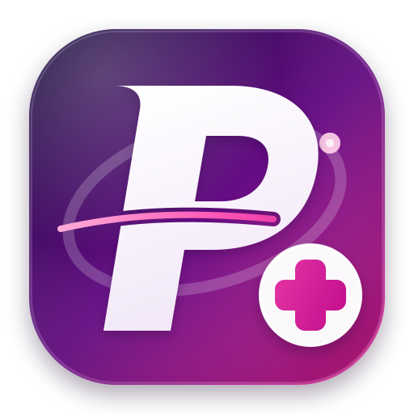
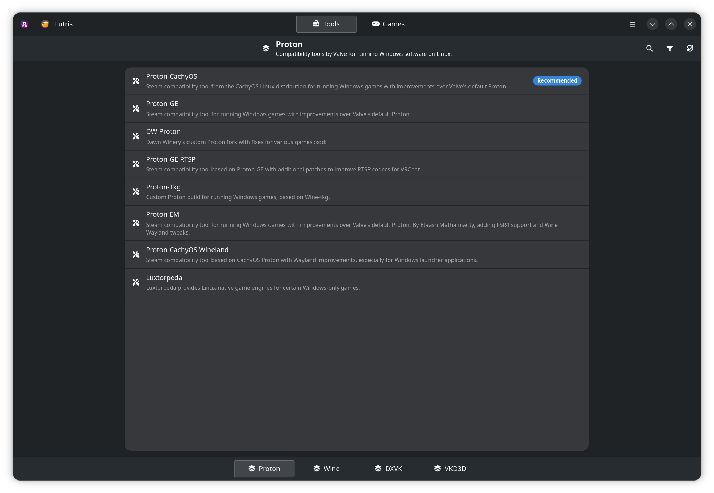
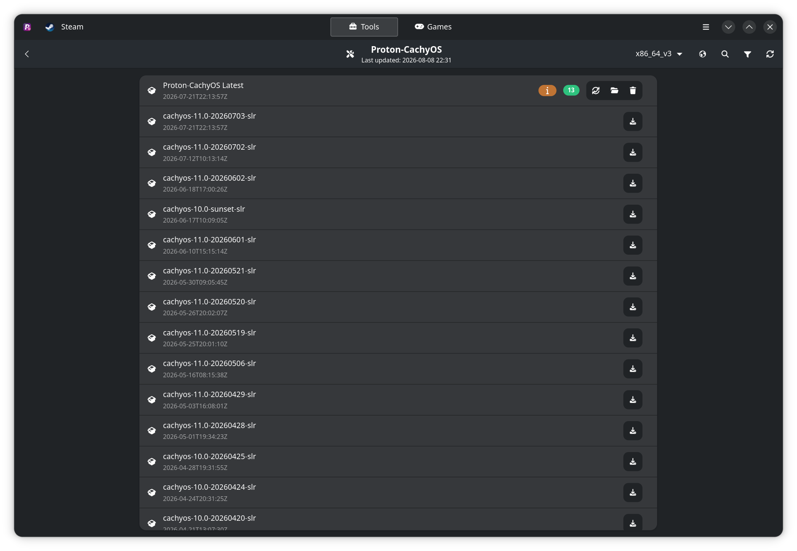
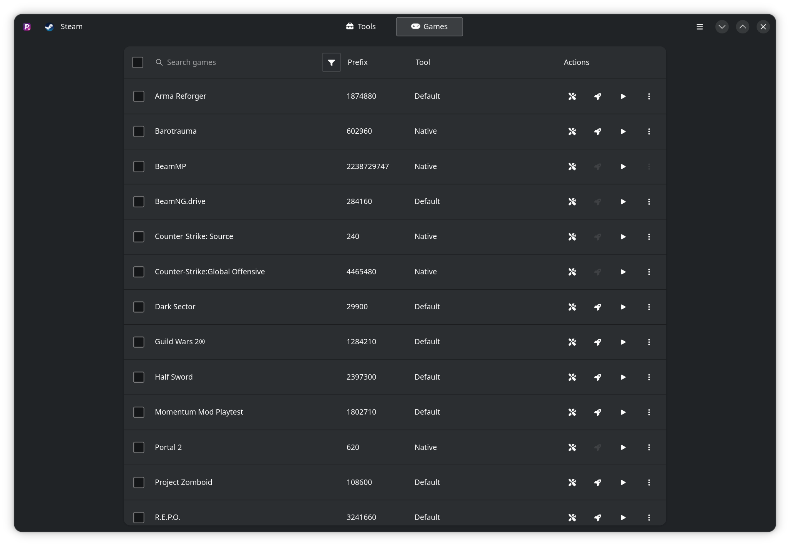
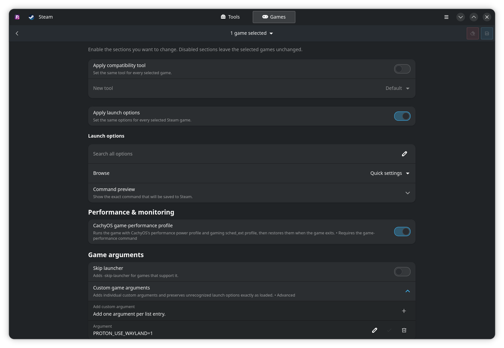

# ProtonPlus

<p align="center">
  
</p>

<p align="center">
  A GTK4 and libadwaita application for managing Windows compatibility tools on Linux.
</p>

<p align="center">
  <a href="https://github.com/Vysp3r/ProtonPlus/stargazers">
    
  </a>
  <a href="https://github.com/Vysp3r/ProtonPlus/releases/latest">
    
  </a>
  <a href="https://klausenbusk.github.io/flathub-stats/#ref=com.vysp3r.ProtonPlus&interval=infinity&downloadType=installs%2Bupdates">
    
  </a>
  <a href="https://github.com/Vysp3r/ProtonPlus/blob/main/LICENSE.md">
    
  </a>
  <a href="https://hosted.weblate.org/engage/protonplus/">
    
  </a>
  <a href="https://protonplus.vysp3r.com/#donate">
    
  </a>
</p>

<p align="center">
  <a href="https://flathub.org/apps/com.vysp3r.ProtonPlus">Flathub</a>
  ·
  <a href="https://github.com/Vysp3r/ProtonPlus/releases">Releases</a>
  ·
  <a href="https://github.com/Vysp3r/ProtonPlus/issues">Issue tracker</a>
</p>

ProtonPlus helps you install, update, remove, and organize compatibility tools used by Steam and other Linux game launchers. It discovers supported launcher installations, downloads releases from their upstream sources, and installs them into the layouts expected by each launcher.

## Features

- Manage Proton, Wine, DXVK, and VKD3D tools from one application.
- Install versioned releases and `Latest` builds, update installed tools, remove old versions, and migrate games between tools where supported.
- Filter release variants against the detected CPU architecture and ISA level,
  including native AArch64 builds and supported x86-64 builds on AArch64 hosts.
- Detect system and Flatpak launcher installations, with Steam Snap support.
- Manage tools for Steam, Faugus Launcher, Lutris, Heroic Games Launcher, Bottles, and WineZGUI.
- Browse Steam games, change default and per-game compatibility tools, edit launch options, and apply compatibility-tool or launch-option changes to multiple games.
- Configure Steam profiles and create or remove a ProtonPlus shortcut in Steam from the preferences view.
- Coordinate required Steam restarts after compatibility-tool or Steam configuration changes.
- Navigate Tools, Games, preferences, dialogs, and menus with a gamepad, with contextual button hints and optional vibration.
- Configure MangoHud presets when MangoHud is installed, including visual, performance, metrics, and extra settings.
- Track downloads and updates from the application header, with cancellation and desktop notifications.
- Use the command-line interface for listing launchers, installing, updating, and uninstalling tools.
- Configure background updates, API tokens, proxy settings, themes, language, legacy-tool visibility, and other application preferences.
- Localized through gettext and Weblate.

## Screenshots

<p align="center">
  
  
  <br>
  
  
</p>

## Supported platforms and launchers

ProtonPlus runs on Linux. It is distributed as a Flatpak and can also be built and installed natively with Meson. The application includes detection for these launcher installations:

| Launcher | Supported installation types | Tool categories |
| --- | --- | --- |
| Steam | System, Flatpak, Snap | Proton, including Steam Tinker Launch |
| Faugus Launcher | System, Flatpak | Selected Proton tools |
| Lutris | System, Flatpak | Proton, Wine, DXVK, VKD3D |
| Heroic Games Launcher | System, Flatpak | Proton, Wine |
| Bottles | System, Flatpak | Proton, Wine, DXVK |
| WineZGUI | System, Flatpak | Wine |

Only installed and detectable launchers are shown. Tool availability also depends on the launcher and installation type.

## Supported compatibility tools

The built-in provider catalog currently contains:

### Proton and Steam tools

- Proton-GE
- Proton-CachyOS
- DW-Proton
- Proton-GE RTSP
- Proton-Tkg
- Proton-EM
- Proton-CachyOS Wineland
- Luxtorpeda
- Boxtron
- Roberta
- Steam Tinker Launch, for Steam

### Wine

- Wine-Proton (Kron4ek)
- Wine-Staging (Kron4ek)
- Wine-Staging-Tkg (Kron4ek)
- Wine-Vanilla (Kron4ek)

### DXVK

- DXVK (doitsujin)
- DXVK GPL+Async (Ph42oN)
- DXVK (Sarek)

### VKD3D

- VKD3D-Proton
- VKD3D-Lutris

Release data is obtained from upstream GitHub, GitLab, Forgejo, and GitHub Actions sources. Available versions and architecture variants are determined by each provider's upstream releases.

## Installation

### Flatpak

The Flathub package is the recommended installation method.

```bash
flatpak install flathub com.vysp3r.ProtonPlus
flatpak run com.vysp3r.ProtonPlus
```

If the Flathub remote is not configured yet:

```bash
flatpak remote-add --if-not-exists \
  flathub https://flathub.org/repo/flathub.flatpakrepo
```

The Flatpak uses host access required to find Steam libraries and launcher data, and requests access to the supported launcher Flatpak data directories. If a launcher is installed in an unsupported location or through a different packaging format, ProtonPlus may not be able to detect it.

### Community packages

The following packages are maintained by distribution packagers or community maintainers. They are not managed by the ProtonPlus project and may have different release timing or packaging defaults than Flathub.

| Distribution | Package source | Maintainer |
| --- | --- | --- |
| Arch Linux | [AUR](https://aur.archlinux.org/packages/protonplus) | [yochananmarqos](https://github.com/yochananmarqos) |
| Fedora | [Copr](https://copr.fedorainfracloud.org/coprs/wehagy/protonplus/) | [wehagy](https://github.com/wehagy) |
| Fedora | [Terra](https://terrapkg.com/) | [Owen Zimmerman](https://github.com/Owen-sz) |
| NixOS | [nixpkgs](https://mynixos.com/nixpkgs/package/protonplus) | [Seth](https://github.com/seth-foss) |
| Ubuntu | [Pacstall](https://pacstall.dev/packages/protonplus) | [Vysp3r](https://github.com/Vysp3r) |
| openSUSE | [OBS](https://software.opensuse.org/package/ProtonPlus) | [rrahl0](https://github.com/rrahl0) |
| Void Linux | [Official repository](https://github.com/void-linux/void-packages) | [xJayMorex](https://github.com/xJayMorex) |
| Gentoo | [Overlay](https://github.com/amielke/amielke-overlay/tree/master/games-util/ProtonPlus) | [amielke](https://github.com/amielke) |

### Native build

A native build requires a Linux development environment with:

- Git, a C compiler, pkg-config, Meson 1.0 or newer, Ninja, and Vala
- GLib and glib-compile-schemas
- GTK4
- libadwaita 1.6 or newer
- json-glib
- libsoup 3
- libgee
- libarchive
- libnotify
- Cairo
- AppStream
- SDL 3.2 or newer
- gettext and desktop-file-utils

Package names differ between distributions. The repository's `scripts/get-dependencies.sh` installs the native build dependencies on Arch Linux; it is intended for Arch-based build environments and should not be run unchanged on other distributions.

Clone and build the application with the project Makefile:

```bash
git clone https://github.com/Vysp3r/ProtonPlus.git
cd ProtonPlus
make build-run
```

If `protonplus` is not already available on `PATH`, `make build-run` installs
the native build before launching it.

To build without launching it, then install it system-wide:

```bash
make install
```

The native build is configured with `/usr` as its install prefix by the Makefile.

### Build the Flatpak locally

The local Flatpak manifest builds the source tree and installs the result for the current user. Flatpak, a configured Flathub remote, and network access are required.

```bash
make local-run
```

The local target installs the GNOME 50 SDK and runtime, the Vala SDK extension, and Flatpak Builder when they are missing. Use `make local` to build and install without launching the application.

## Usage

### Graphical interface

1. Launch ProtonPlus and select a detected launcher from the launcher selector.
2. Open the **Tools** view and choose a tool category.
3. Select a tool to browse upstream releases, choose a release or variant, and install it.
4. Use the installed, used, and unused filters to review tool usage.
5. Open a release to update, remove, open its upstream page, or migrate compatible games when supported.
6. For Steam, use **Games** to select a profile, change compatibility tools, edit launch options, or perform a mass edit.
7. If MangoHud is detected, enable experimental features to use the **MangoHud** view.

Downloads and updates appear in the header indicator. ProtonPlus also sends desktop notifications when an operation finishes while the application is not active.

### Controller input

ProtonPlus supports gamepad navigation through SDL 3. Use the D-pad or left
stick to move, the right stick to scroll, the configured confirm face button
to activate controls, and the other face button to go back or close the active
dialog or menu. Shoulder and dedicated controller buttons provide contextual
page, section, search, filter, menu, and launcher shortcuts where available;
the hint bar shows the actions supported by the current view.

On Steam Deck, focus a text field and use **Steam + X** to open the on-screen
keyboard. Other systems may require a physical or system-provided keyboard for
text entry.

### Command-line interface

Running `protonplus` without arguments opens the graphical interface. The CLI accepts these commands:

```text
protonplus version
protonplus help
protonplus list [launcher_id]
protonplus install <launcher_id> <runner_id> [latest]
protonplus uninstall <launcher_id> <runner_id|all> [all]
protonplus update <all|launcher_id> [runner_id]
```

List detected launchers and installed tools first; the command output includes the IDs accepted by the other commands:

```bash
protonplus list
protonplus list steam-system
protonplus install steam-system proton-ge latest
protonplus update steam-system
protonplus update all
protonplus uninstall steam-system proton-ge
```

The `latest` argument selects the latest eligible release during installation. The `all` argument can remove all releases for a tool or all provider-tool releases for a launcher.

## Configuration

Application preferences are available from the preferences dialog. They include:

- Appearance themes: system, Adwaita, Breeze, SteamOS, and OLED
- Language selection and translated interface text
- Controller confirm-button mapping and optional vibration
- Background update frequency and update checks at launch or system startup
- Default Steam compatibility tool and selected Steam profile
- GitHub and GitLab API tokens for higher API limits or authenticated access
- System or manual proxy configuration
- Legacy-tool visibility, experimental features, and default-prefix migration behavior
- Cache deletion and application environment diagnostics

Native builds use the XDG user cache directory, normally `~/.cache/ProtonPlus`. Flatpak builds use the corresponding sandboxed XDG directories.

## Troubleshooting

### A launcher is not detected

Confirm that the launcher is installed and has been opened at least once, then refresh ProtonPlus. For Flatpak launchers, make sure the corresponding Flatpak application data exists and that ProtonPlus was installed with the official Flatpak package. Steam libraries on custom locations must also be visible to the ProtonPlus installation.

### Release loading fails or an API limit is reached

Check the network connection and the proxy setting in **Preferences > Advanced > Network**. GitHub and GitLab access tokens can be configured under **API Tokens**. An invalid token or an upstream API outage is reported separately from a missing release.

### An install or update is blocked

Close games that are using the compatibility tool. ProtonPlus refuses certain updates while a game is running to avoid modifying an active installation.

### Cached release data or downloads appear stale

Use the cache deletion action in the preferences dialog, then retry the operation. This clears ProtonPlus's cached release data and downloaded archives; releases are fetched again from their upstream sources.

### An archive cannot be installed

The provider may have published an asset in an unsupported or incomplete format. Refresh the release data and retry. If the problem persists, report the provider, release, and exact error in the [issue tracker](https://github.com/Vysp3r/ProtonPlus/issues).

## Development

Run the test suite after making changes:

```bash
make tests
```

Useful maintenance commands are exposed through the Makefile:

```bash
make linter
make translations
make icons
make clean
```

Provider extension points and release-source architecture are documented in [docs/provider-architecture.md](docs/provider-architecture.md).

Please read [CONTRIBUTING.md](CONTRIBUTING.md) before opening a pull request. Bug reports and feature requests belong in the [issue tracker](https://github.com/Vysp3r/ProtonPlus/issues). Translation contributions are coordinated through [Weblate](https://hosted.weblate.org/projects/protonplus/protonplus/).

## AI-assisted development

AI tools, including OpenAI Codex, have been used to help advance ProtonPlus further. AI was used as a supporting engineering tool within a structured development process, under human direction and subject to code review, testing, and validation. Project decisions and final responsibility remain with the maintainers.

## License

ProtonPlus is licensed under the [GNU General Public License version 3 or later](LICENSE.md).
