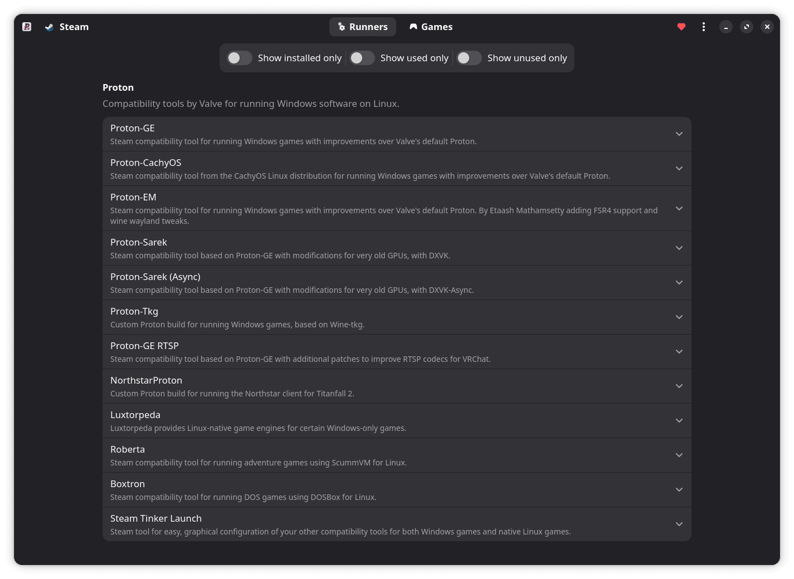

<h1 align="center">
    
    <br><br>
    ProtonPlus
</h1>

<p align="center">
  <strong>A modern compatibility tools manager</strong>
</p>

<p align="center">
    <a href="https://github.com/Vysp3r/ProtonPlus/stargazers">
      
    </a>
    <a href="https://github.com/Vysp3r/ProtonPlus/releases/latest">
      
    </a>
    <a href="https://klausenbusk.github.io/flathub-stats/#ref=com.vysp3r.ProtonPlus&interval=infinity&downloadType=installs%2Bupdates">
      
    </a>
    <a href="https://github.com/Vysp3r/ProtonPlus/blob/main/LICENSE.md">
      
    </a>
    <a href="https://t.me/ProtonPlus">
      
    </a>
</p>

<p align="center">
    Don't forget to star the repo if you are enjoying the project!</i>
</p>

[](https://flathub.org/apps/details/com.vysp3r.ProtonPlus)

## ✨ Features

- Manage supported compatiblity tools across supported launchers
- Change the compatibility tool and launch options of your Steam games
- And much more...

<details>
  <summary>Supported launchers</summary>
    
  - Steam
  - Lutris
  - Heroic Games Launcher
  - Bottles

*The launcher you wanted is missing? Simply request for it to be added [here](https://github.com/Vysp3r/ProtonPlus/issues/new?template=feature_request.md)!*

</details>

<details>
  <summary>Supported compatibility tools</summary>

  - Steam Tinker Launch
  - Proton-GE
  - Luxtorpeda
  - Boxtron
  - Roberta
  - NorthstarProton
  - Proton-GE RTSP
  - Proton CachyOS
  - Proton EM
  - Proton Tkg
  - Proton Sarek
  - Kron4ek Proton
  - Kron4ek Wine-Builds Vanilla
  - Kron4ek Wine-Builds Staging
  - Kron4ek Wine-Builds Staging-Tkg
  - DXVK
  - DXVK (Sarek)
  - DXVK Async (Sarek)
  - DXVK GPL+Async (Ph42oN)
  - VKD3D-Lutris
  - VKD3D-Proton

  *The compatibility tool you wanted is missing? Simply request for it to be added [here](https://github.com/Vysp3r/ProtonPlus/issues/new?template=feature_request.md)!*

</details>

## 📦️ Installation methods

<a href="https://flathub.org/apps/com.vysp3r.ProtonPlus">
    
</a>

<p></p>

> [!IMPORTANT]
> The main installation method is Flathub

### [Arch Linux (AUR)](https://aur.archlinux.org/packages/protonplus) (Maintained by yochananmarqos)

### [Fedora (COPR)](https://copr.fedorainfracloud.org/coprs/wehagy/protonplus/) (Maintained by wehagy)

### [NixOS (MyNixOS)](https://mynixos.com/nixpkgs/package/protonplus) (Maintained by Seth)

### [Ubuntu (Pacstall)](https://pacstall.dev/packages/protonplus) (Maintained by Vysp3r)

### [openSUSE](https://software.opensuse.org/package/ProtonPlus) (Maintained by rrahl0)

### [Void](https://github.com/xJayMorex/ProtonPlus-void) (Maintained by xJayMorex)

## 🏗️ Building from source

**Requirements**

- [git](https://github.com/git/git)
- [ninja](https://github.com/ninja-build/ninja)
- [meson >= 1.0.0](https://github.com/mesonbuild/meson)
- [gtk4](https://gitlab.gnome.org/GNOME/gtk/)
- [libadwaita >= 1.5](https://gitlab.gnome.org/GNOME/libadwaita)
- [json-glib](https://gitlab.gnome.org/GNOME/json-glib)
- [libsoup](https://gitlab.gnome.org/GNOME/libsoup)
- [libarchive](https://github.com/libarchive/libarchive)
- [desktop-file-utils](https://gitlab.freedesktop.org/xdg/desktop-file-utils)
- [libgee](https://gitlab.gnome.org/GNOME/libgee)

<details>
  <summary>Linux</summary>

1. Install all dependencies (I am on Fedora, so for you this line might be different)
    ```bash
    sudo dnf install \
      git \
      gettext \
      'meson >= 1.0.0'\
      vala \
      desktop-file-utils \
      libappstream-glib \
      'pkgconfig(gee-0.8)' \
      'pkgconfig(glib-2.0)' \
      'pkgconfig(gtk4)' \
      'pkgconfig(json-glib-1.0)' \
      'pkgconfig(libadwaita-1) >= 1.5' \
      'pkgconfig(libarchive)' \
      'pkgconfig(libsoup-3.0)'
    ```

2. Clone the GitHub repo and change to repo directory
    ```bash
    git clone https://github.com/Vysp3r/ProtonPlus.git && \
      cd ProtonPlus
    ```

3. Build the local source code as a native application
    ```bash
    ./scripts/build-native.sh

    # Alternative: Runs application after the build.
    ./scripts/build-native.sh run
    ```

4. (Optional) Install the application
    ```bash
    cd build-native
    ninja install
    ```

5. Run the application
    ```bash
    cd src && \
    ./com.vysp3r.ProtonPlus
    ```
</details>

<details>
  <summary>Linux (Flatpak Builder)</summary>

1. Install all dependencies (I am on Fedora, so for you this line might be different)
    ```bash
    sudo dnf install \
      git \
      flatpak
    ```

2. Add the flathub repo to your system if not added before
    ```bash
    flatpak --if-not-exists remote-add \
      flathub https://flathub.org/repo/flathub.flatpakrepo
    ```

3. Install the necessary runtimes and build tools for Flatpak
    ```bash
    flatpak install \
      runtime/org.gnome.Sdk/x86_64/48 \
      runtime/org.gnome.Platform/x86_64/48 \
      runtime/org.freedesktop.Sdk.Extension.vala/x86_64/24.08 \
      org.flatpak.Builder
    ```

4. Clone the GitHub repo and change to repo directory
    ```bash
    git clone https://github.com/Vysp3r/ProtonPlus.git && \
      cd ProtonPlus
    ```

5. Build the local source code as a Flatpak and install for the current user
    ```bash
    ./scripts/build-local.sh

    # Alternative: Runs application after the build.
    ./scripts/build-local.sh run
    ```

6. Run the application
    ```bash
    flatpak --user run \
      com.vysp3r.ProtonPlus
    ```
</details>

## 🌐 Translate

**You can translate ProtonPlus on [Weblate](https://hosted.weblate.org/projects/protonplus/protonplus/) or by modifying the files directly**

## 🙌 Contribute

**Please read our [Contribution Guidelines](/CONTRIBUTING.md)**

All contributions are highly appreciated.

## 👥 Contributors

[](https://github.com/Vysp3r/ProtonPlus/graphs/contributors)
